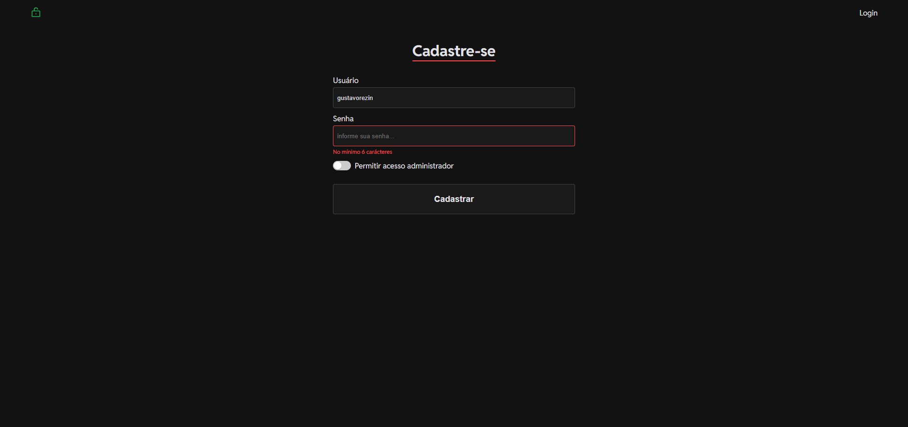
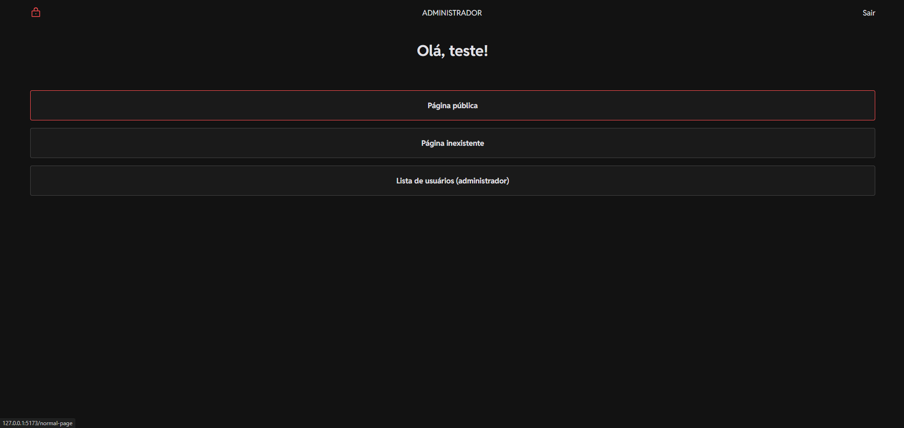
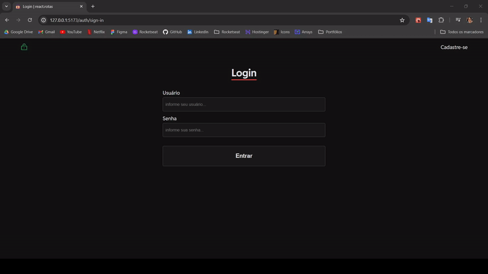

# Página de Login com Rotas 💻

Projeto pessoal, desenvolvido com o intuito de praticar alguns conhecimentos em React.

## 🎨 Layout

<p align="center">
    
    
</p>



## 🛠️ Tecnologias utilizadas

[](https://skillicons.dev)

- [React Query](https://tanstack.com/query/latest/docs/framework/react/quick-start)
- [Axios](https://axios-http.com/docs/intro)
- [React Router](https://reactrouter.com/en/main)
- [React Hook Form](https://react-hook-form.com/get-started)
- [Zod](https://zod.dev/?id=basic-usage)
- [Styled Components](https://styled-components.com/docs)
- [Radix](https://www.radix-ui.com/themes/docs/overview/getting-started)
- [Json Server](https://www.npmjs.com/package/json-server)
- [Sonner Toaster](https://sonner.emilkowal.ski/)
- [Helmet](https://www.npmjs.com/package/react-helmet-async)
- [Phosphor Icons](https://phosphoricons.com/)

## 📝 Começando

1. **Instale as dependências**: `npm install` ou `yarn`
2. **Variáveis de ambiente**: Copie `.env.example` para um novo `.env.local`
3. **Comece a desenvolver**: `npm run start:json-server (api) & npm run dev (frontend)`

## 🚀 Contribuir

Se você quiser contribuir, clone este repositório, crie sua própria branch de trabalho e mãos à obra!

1. **Clone o projeto**:

```bash
git clone https://github.com/gustavorezin/react-login-rotas.git
```

2. **Crie uma feature/branch**:

```bash
git checkout -b feature/NAME
```

No final, abra um Pull Request explicando o problema resolvido ou a funcionalidade adicionada. Se existir, adicione capturas de tela das modificações visuais e aguarde pela revisão!

[Como criar um Pull Request](https://www.atlassian.com/br/git/tutorials/making-a-pull-request) |
[Padrão de commits](https://gist.github.com/joshbuchea/6f47e86d2510bce28f8e7f42ae84c716)

## 📃 Licença

- Este projeto está sob a licença [MIT](./LICENSE)
